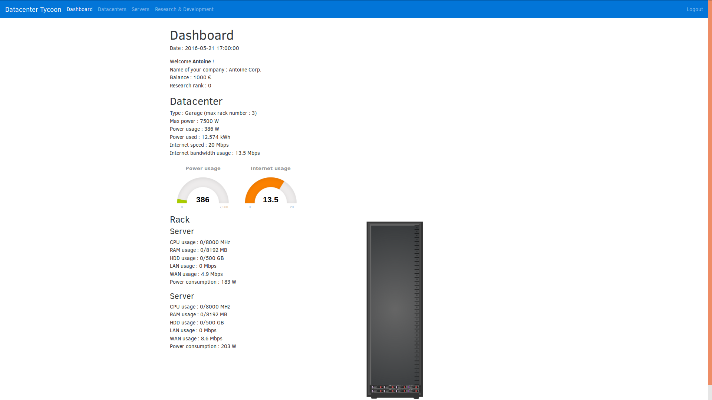

# DataCenter Tycoon

The goal of this web-based game is to manage your datacenter company : buy more servers, upgrade your datacenter resources (like the Internet connection and the electricity supply) and make money !

## /!\ Work In Progress /!\
Warning : This game is a Work In Progress !

## Requirements
* A classic LAMP (Linux, Apache, MySQL, PHP) setup
* Needed packages : ```php5-dev```, ```libzmq3-dev```, ```memcached``` and ```php5-memcached``` : ```sudo apt-get install php5-dev libzmq3-dev memcached```
* PHP ZeroMQ extension. You will probably need to install [PHP-Pear](https://pear.php.net/manual/en/installation.php) first.
  * ```sudo pecl install zmq-beta```,
  * Then add ```extension=zmq.so``` to your php.ini file
* Make sure that the parameter ```session.cookie_domain``` is correctly set in your php.ini file.
* Redis

## Screenshot

